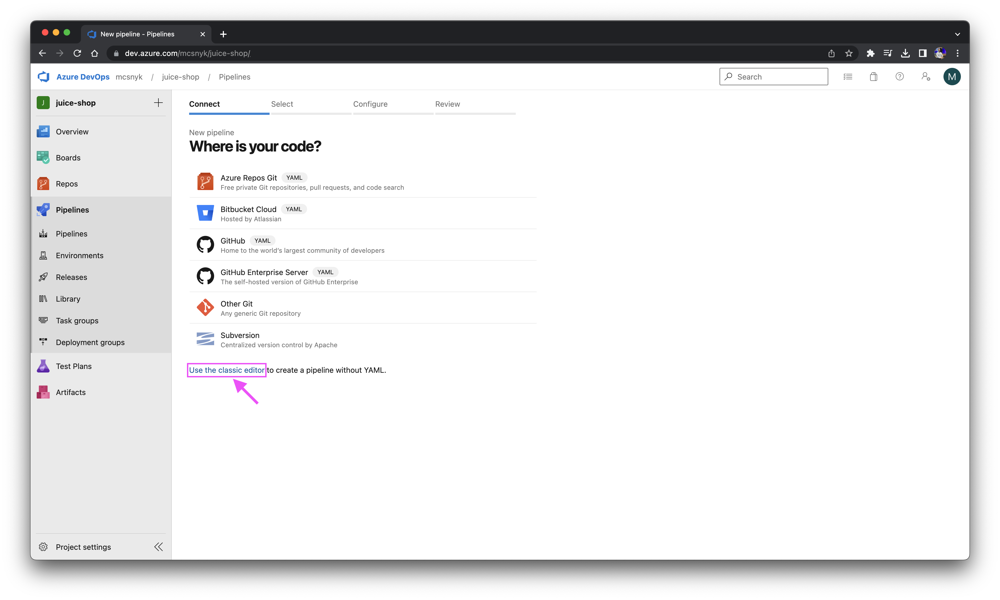
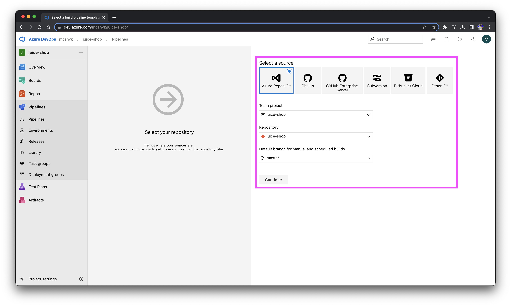
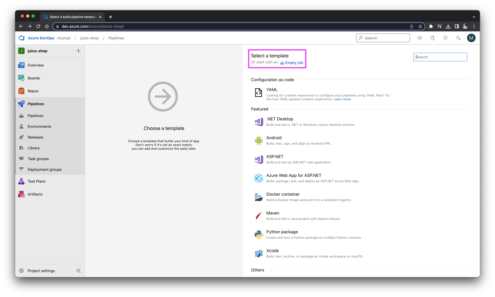
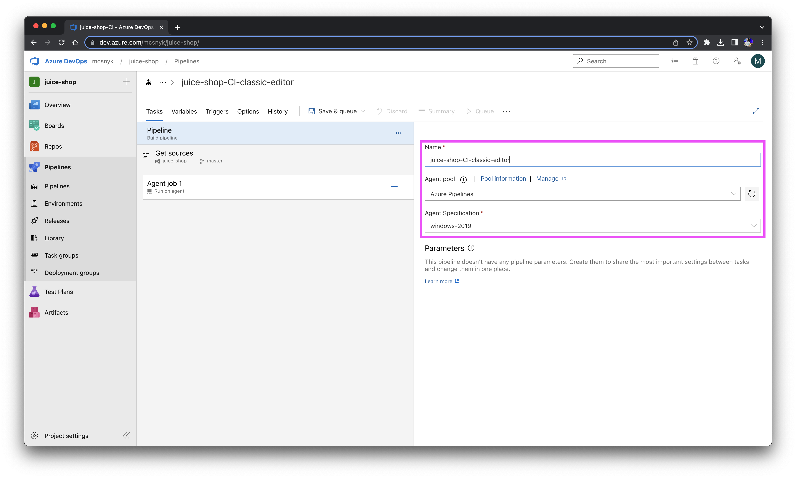
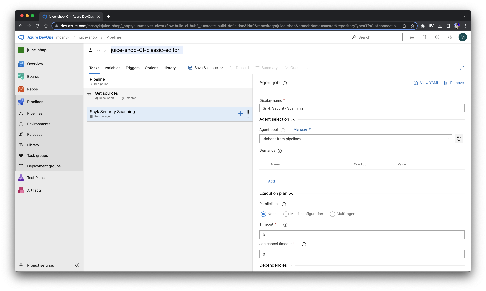
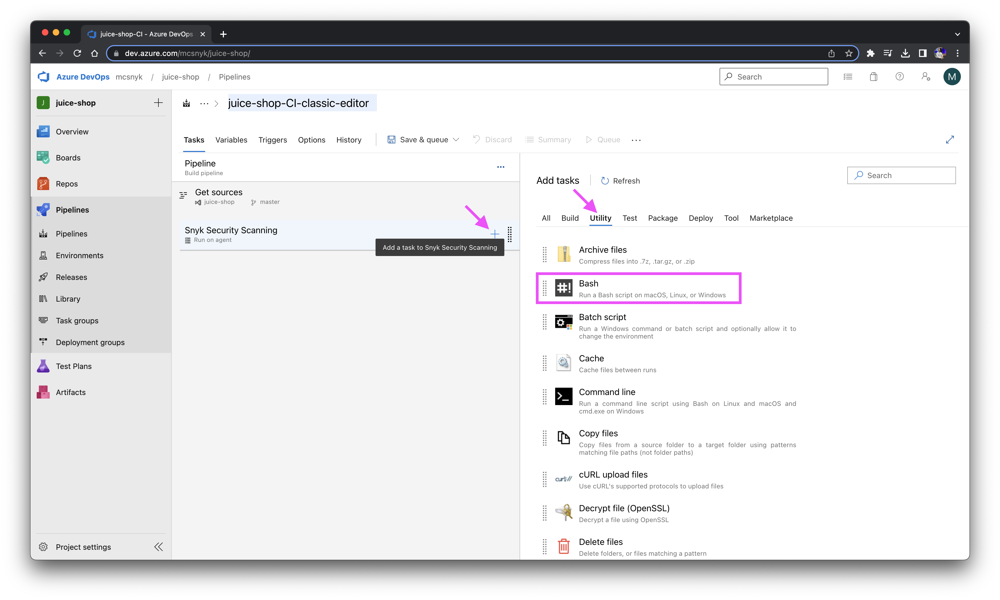
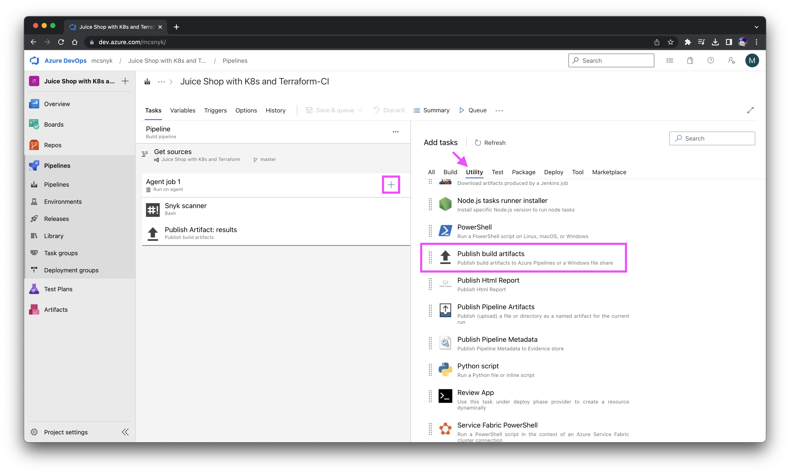
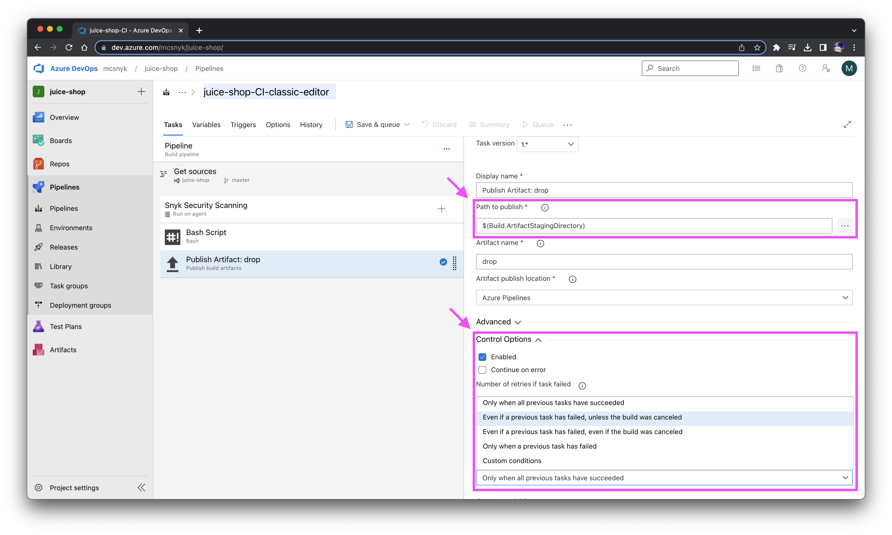
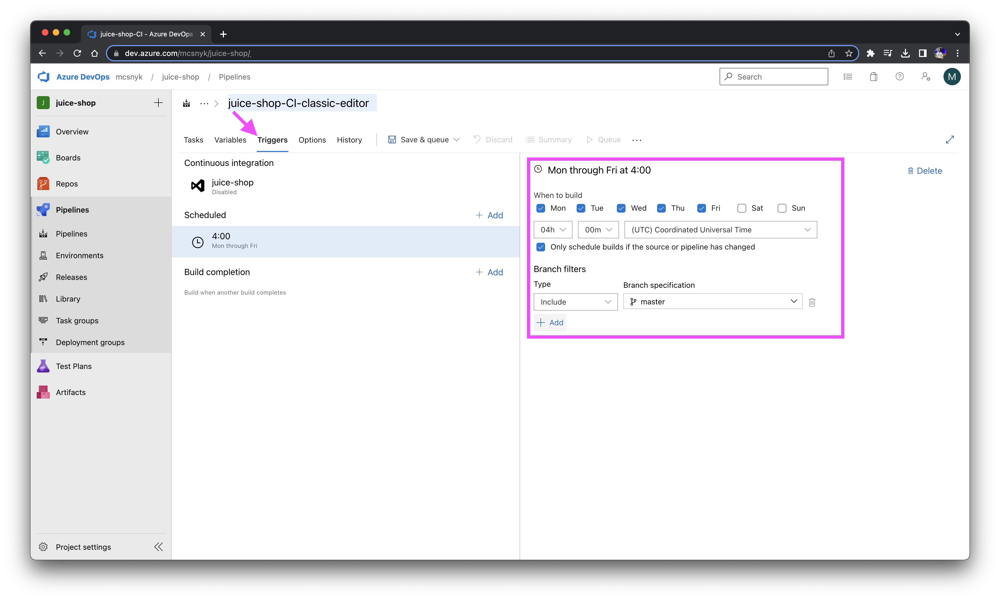
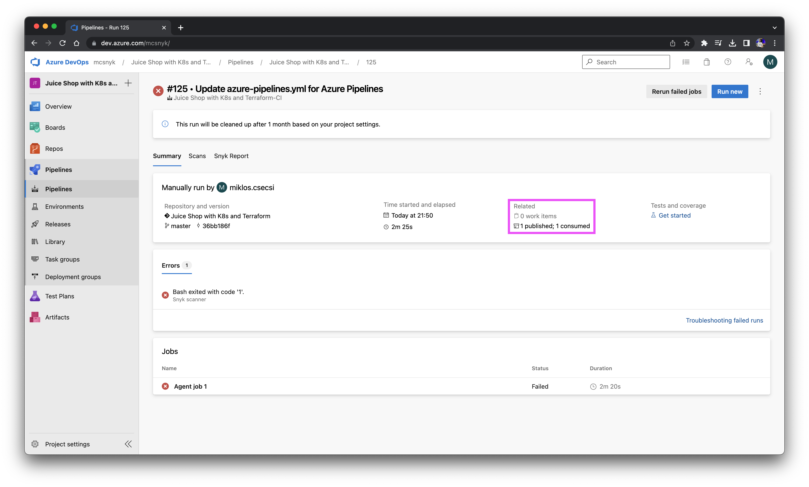

# Azure Pipelines - Classic Editor (pipeline without YAML)

One way to run Snyk in an Azure Pipeline can be achieved by installing the Snyk CLI using the <b><i>classic editor</i></b> to create a pipeline without YAML.<br/>

## Workflow
- [ ] Create a new pipeline and on the <b><i>Connect</i></b> tab select the <b><i>Use the classic editor</i></b> option.<br/>



- [ ] Select a source where you store your application data (<i>Azure Repos Git, GitHub, GitHub Enterprise Server, Subversion, Bitbucket Cloud and Other Git</i>).
In this example the application data is stored in an Azure Repos repository.<br/>
Then, select the appropriate values for the fields <b><i>Team project</i></b>, <b><i>Repository</i></b> and <b><i>Default branch for manual and scheduled builds</i></b>.<br/>



Click on continue<br/>

- [ ] You may select a template, but in this workflow we'll start off an empty job (equivalent with the <b><i>Empty pipeline</i></b> tile)<br/>



- [ ] In the next step we need to give our pipeline a <b><i>name</i></b> and select the <b><i>agent pool</i></b> and its <b><i>specification</i></b>. When you queue a build, it executes on an agent from the selected pool. You can select a Microsoft-hosted pool, or a self-hosted pool that you manage. In this example, we used a default agent pool and the <b><i>windows-2019</i></b> specification.<br/>



- [ ] Let's configure the agent job next. We can give it a name, because of practical reasons we recommend using <i>"Snyk Security Scanning"</i> or similar.<br/>
We will neither change the Agent Pool ("<i>\<inherit from pipeline></i>") nor add demands or parallelism to the pipeline execution.



- [ ] Let's add a [Bash v3 task](https://learn.microsoft.com/en-gb/azure/devops/pipelines/tasks/reference/bash-v3?view=azure-pipelines&viewFallbackFrom=azure-devops) to our pipeline, we'd like to install and run the [Snyk CLI](https://docs.snyk.io/snyk-cli) and the [snyk-to-html](https://docs.snyk.io/scan-application-code/snyk-code/cli-for-snyk-code/displaying-the-cli-results-in-an-html-format-using-the-snyk-to-html-feature) tool as a Bash script on our Windows agent.</br>

With the latter tool we're able to display the CLI scan results in an HTML format in the Azure Devops Pipelines environment and we'll be able to download the generated html files as pipeline artifacts afterwards.</br>

We're using Bash v3 task instead of v2, because the script task consistency is improved and there is added support for multiple lines and added support for Windows.</br>

:hammer_and_wrench: You can find the [GNU Bash manual here](https://www.gnu.org/software/bash/manual/)</br>



As the target script type instead of selecting the File Path, choose the <b><i>Inline</i></b> option. You may use the following script as a basic Snyk script to scan your application:    

```bash session
# Install Snyk and snyk-to-html
npm install --location=global snyk snyk-to-html
echo 'Snyk installed'

# Authenticate with Snyk
snyk auth $SNYK_TOKEN

set +e

# Test Snyk Code:
snyk code test --sarif-file-output=code_results.sarif
RESULT_CODE=$?
snyk-to-html -o "$(Build.ArtifactStagingDirectory)\code_results.html" < code_results.sarif

# Test Snyk Open Source:
snyk test --all-projects --json-file-output=os_results.json
RESULT_OS=$?
snyk-to-html -o "$(Build.ArtifactStagingDirectory)\os_results.html" < os_results.json

# Test Snyk Container:
# NOTE: Change the image name!
snyk container test mcsnyk/juice-shop --file=Dockerfile --json-file-output=container_results.json
RESULT_CONTAINER=$?
snyk-to-html -o "$(Build.ArtifactStagingDirectory)\container_results.html" < container_results.json

# Test Snyk IaC:
snyk iac test --json-file-output=iac_results.json
RESULT_IAC=$?
snyk-to-html -o "$(Build.ArtifactStagingDirectory)\iac_results.html" < iac_results.json

# Check results:
if [ $RESULT_CODE -eq 1 ]
then
     exit $RESULT_CODE
elif [ $RESULT_OS -eq 1 ]
then
     exit $RESULT_OS
elif [ $RESULT_IAC -eq 1 ]
then
     exit $RESULT_IAC
elif [ $RESULT_CONTAINER -eq 1 ]
then
     exit $RESULT_CONTAINER
fi
```

- [ ] Before we move on, we have to add an environment variable to the task: <b>SNYK_TOKEN</b>


- [ ] Now we're ready to "upload" the generated html-files to the Artifact Staging Directory where we can download them anytime later on. Let's add the <b><i>Publish Build Artifact</i></b> to the Agent tasks.



- [ ] We can give a <b><i>display name</i></b>, a <b><i>path to publish</i></b> (the folder or file path to publish. This can be a fully-qualified path or a path relative to the root of the repository) and an <b><i>artifact name</i></b> (the name of the artifact to create in the publish location). 

As a <b><i>path to publish</i></b> enter:
```js
$(Build.ArtifactStagingDirectory)/
```

Among the Control Options select when to run this task: <b><i>Only when all previous tasks have succeded</i></b>. 


- [ ] OPTIONAL: we can set additional triggers to the pipeline and schedule the build. To do so, let's take a look at the <b><i>Triggers</i></b> tab! Once we're ready with settings up the pipeline, we can <b><i>Save</i></b> or <b><i>Save & queue</i></b> the pipeline.  
 

- [ ] Once a build finishes, you can download the generated artifacts from the site of the build run:
 
