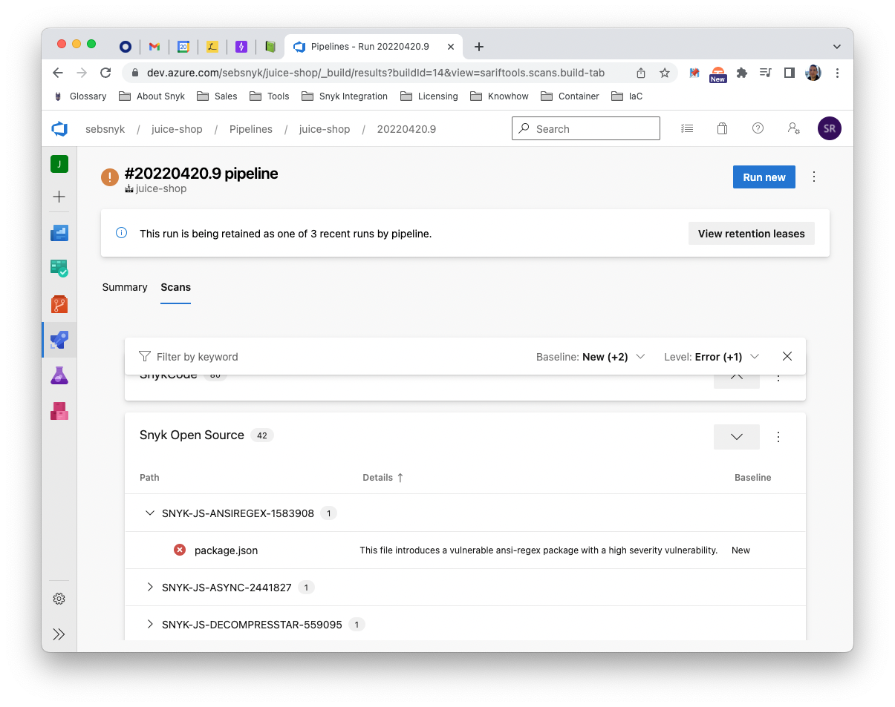
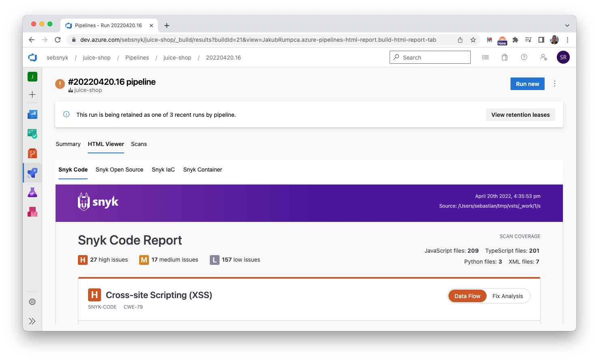
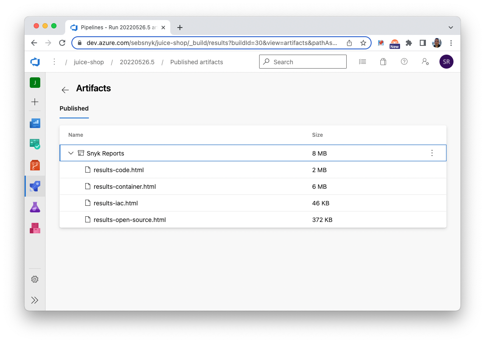

# Azure Pipelines

## Inline display of [SARIF data](https://github.com/microsoft/sarif-tutorials/blob/main/docs/1-Introduction.md#:~:text=SARIF%2C%20the%20Static%20Analysis%20Results,for%20use%20by%20simpler%20tools.)

Azure pipelines support the inline display of scan results via a [plugin][sarif-viewer-plugin]. 

See [cli/simple-example/AzurePipelines-npm-generic-sarif.yml](cli/simple-example/AzurePipelines-npm-generic-sarif.yml) for instructions how to get this output.

## HTML reports

You can also use `snyk-to-html` to create HTML artifacts. They can be browsed using a [plugin][html-viewer-plugin] or downloaded from the pipeline.

The HTML reports are also available for download directly from the pipeline page ("Related"):

See [cli/simple-example/AzurePipelines-npm-generic-html.yml](cli/simple-example/AzurePipelines-npm-generic-html.yml) for instructions how to get this output.

[sarif-viewer-plugin]: https://marketplace.visualstudio.com/items?itemName=sariftools.scans&targetId=bf3858e2-f2d0-4e06-962a-2107402a1234
[html-viewer-plugin]: https://marketplace.visualstudio.com/items?itemName=JakubRumpca.azure-pipelines-html-report