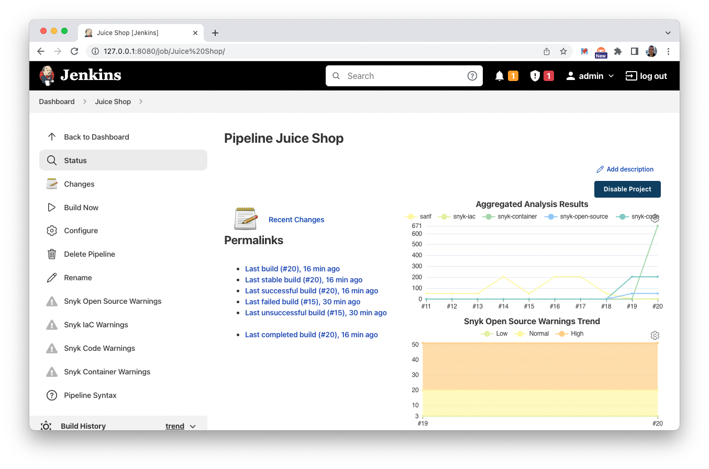
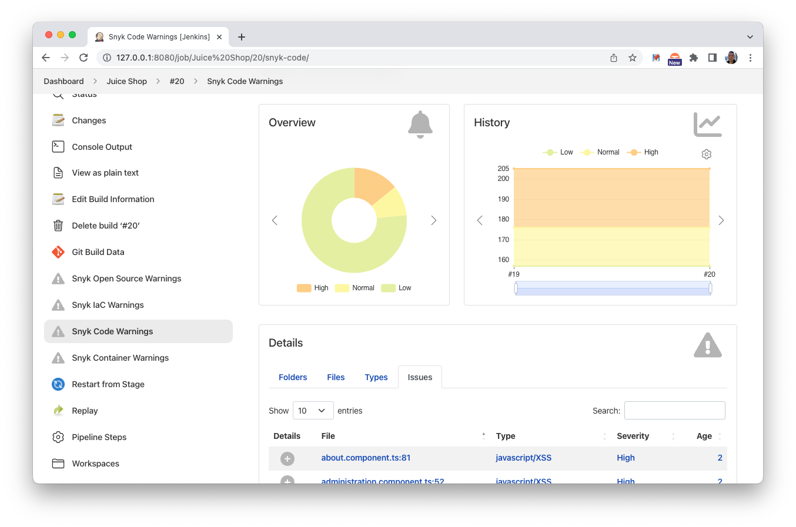
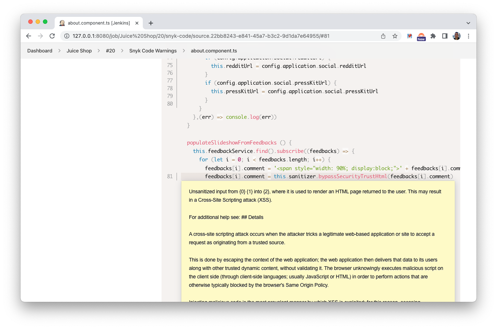

# Jenkins Pipelines

Jenkins supports a declarative way to configure pipelines, using the https://www.jenkins.io/solutions/pipeline plugin.

Using this approach, Snyk can be enabled in a straightforward way.

The [example](./Jenkinsfile-npm-install-generic.groovy) listed in this folder will activate all of Snyk's products and output to the Jenkins status pages using the warnings-ng plugin. The installation is based on `npm install`, for a directly download of Snyks CLI binaries, refer to [Jenkinsfile-manual-generic.groovy](Jenkinsfile-manual-generic.groovy).

The scripts may depend on various plugins. Please follow the information within the scripts to install them.

## Using snyk-filter with Jenkins

The [example with snyk-filter](./Jenkinsfile-npm-install-with-snyk-filter.groovy) in this folder will scan using Snyk's open source product and outputs the results as a json file. It will then run [snyk-filter](https://github.com/snyk-tech-services/snyk-filter) which accepts that json file and the location to the [filter](./exploitable_cvss_9.yml) as inputs. 

### Example of filter

```
version: 2
customFilters:
  filter: ".vulnerabilities |= map(if (  select(.exploit != null and .exploit != \"Not Defined\" and .exploit != \"Unproven\" and .cvssScore>=9.0)) then . else empty end)"
  pass: ".vulnerabilities[] | select(.exploit != null and .exploit != \"Not Defined\" and .exploit != \"Unproven\" and .cvssScore>=9.0) | length"
  msg: "Exploitable Vulnerabilities with CVSS Score of 9 or higher found"
```

## Samples

Trend lines across all of Snyks products.



High level overview for a product is available.



Snyk Code issues can be seen in detail, including their occurance within the source code file.


